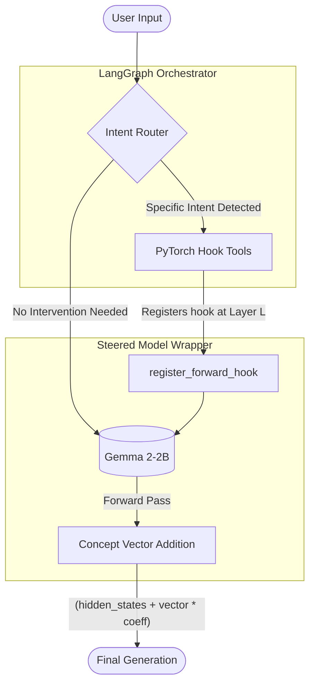

# LLM Intent-Based Activation Steering


This repository demonstrates Activation Steering (also known as representation engineering or concept injection) applied dynamically to Open-Weights Large Language Models at runtime. By intervening directly in the forward pass of a model (e.g., `google/gemma-2-2b-it`), we can alter the model's behavior, tone, or topical focus without relying on complex prompt engineering, fine-tuning, or RLHF.

This project introduces an Intent Router using LangGraph. This router dynamically applies PyTorch hooks to inject pre-computed concept vectors based on the user's implicit intent or explicit instructions, effectively treating model internals as tool calls.

## Key Features

* **Dynamic Activation Steering:** Modifies the hidden states of an LLM during generation via PyTorch `register_forward_hook`.
* **Agentic Routing with LangGraph:** Analyzes user input to determine which steering vector to apply, and at which layer, acting as a high-level orchestrator.
* **Plug-and-Play Concept Vectors:** Includes extracted latent vectors representing:
  * Lower Confidence / Uncertainty
  * Joyful Tone
  * Topical Focus (e.g., Mentioning Cats)
  * Surprise Me (Synthetic random noise vector for architectural demonstration)
* **Real-Time Dashboard:** Features a UI that visualizes steering hooks activating in real-time, built with FastAPI.

## System Architecture

The pipeline consists of three main components orchestrating generation. While the intent router can utilize an external LLM API, the final execution uniquely uses tool calling to directly manipulate a local neural network's forward pass rather than relying on external web services.



## How It Works

### Activation Steering

The core intervention happens in `SteeredModelWrapper`. It wraps a HuggingFace `AutoModelForCausalLM` and exposes a LangChain-compatible `invoke` interface. When a steering tool is triggered, it registers a forward hook on a specific transformer layer that adds a concept vector to the hidden states during generation:

```python
def hook_fn(module, input, output):
    hidden_states = output[0] if isinstance(output, tuple) else output
    steering_vec = vector.to(hidden_states.device).to(hidden_states.dtype)
    
    # Activation steering: shift hidden states toward concept direction
    hidden_states = hidden_states + (steering_vec * coeff)
    
    return (hidden_states,) + output[1:] if isinstance(output, tuple) else hidden_states
```

### Routing

Two routing modes are available:
* **`steering.py`** -- Uses `ChatMistralAI` as an LLM-based router that decides which steering tools to invoke based on conversational context. Requires a Mistral API key.
* **`local_steering.py`** -- A regex-based router for fully offline use. Matches keywords in the user's message to determine which tools to call. No API required.

The server falls back to the local router automatically if no Mistral API key is set.

### Steering Vectors

The included vectors (saved as `.npy` files) represent directions in the model's activation space corresponding to specific concepts. They were sourced from [Neuronpedia](https://www.neuronpedia.org/) and are applied at layer 20 of the 26-layer Gemma 2-2B architecture.

Available vectors (with default coefficients):
| Vector | Effect | Layer | Default Coefficient |
|--------|--------|-------|---------------------|
| Uncertainty | Increases hedging language, reduces overconfidence | 20 | 95.0 |
| Joyful | Shifts tone toward positivity and enthusiasm | 20 | 95.0 |
| Cat | Biases the model toward mentioning cats | 20 | 130.0 |
| Surprise Me | Synthetic random noise vector (demo only, not a real extracted direction) | 20 | 80.0 |

## Project Structure

```
.
├── steering.py            # LLM-routed steering (Mistral API)
├── local_steering.py      # Regex-routed steering (offline)
├── server.py              # FastAPI server, serves UI and /chat endpoint
├── static/
│   └── index.html         # Chat UI with real-time steering state dashboard
├── vectors/
│   ├── uncertainty_steering_vector.npy
│   ├── joyful_steering_vector.npy
│   └── cat_steering_vector.npy
├── test_steering.py       # Integration tests for steering tools
├── test_server_request.py # Basic server endpoint test
├── test_multi_tool.py     # Multi-tool activation test
├── requirements.txt
└── README.md
```

## Setup

### Requirements

- Python 3.10+
- ~5 GB disk space (the Gemma 2-2B model is downloaded from HuggingFace on first run)
- A HuggingFace account with access to `google/gemma-2-2b-it` (you may need to accept the model's license agreement)
- A [Mistral API key](https://console.mistral.ai/) (Required for the `steering.py` LLM router)
- A [LangSmith API key](https://smith.langchain.com/) (Required for LangGraph orchestration and tracing)

### Installation

```bash
git clone https://github.com/bunch21m/llm-intent-activation-steering.git
cd llm-intent-activation-steering

python -m venv venv
source venv/bin/activate  # On Windows: venv\Scripts\activate

pip install -r requirements.txt
```

### Running

With the Mistral LLM router:
```bash
# bash
export MISTRAL_API_KEY="your_api_key_here"
python server.py
```

```powershell
# PowerShell
$env:MISTRAL_API_KEY="your_api_key_here"
python server.py
```

Without an API key (uses the local regex router automatically):
```bash
python server.py
```

The server starts at `http://127.0.0.1:8000` with a chat interface and a sidebar showing which steering vectors are currently active.

### Performance Note

The local model runs inference on whatever hardware is available. On a CUDA GPU, responses are near-instant. On CPU, expect **30 seconds -3 minutes per response** depending on your machine -- the model is 2.5 billion parameters running a full forward pass locally. The steering vector addition itself adds negligible overhead; the generation step is the bottleneck.

## Examples

Activation steering allows us to shift the model's output distribution without changing the prompt. The examples below use the exact same input prompt but apply different concept vectors at Layer 20 during the forward pass.

**Base Prompt:** *"Write a short paragraph about what you think about the future of AI."*

**1. No Steering (Baseline)**
> The future of AI is brimming with both extraordinary potential and complex challenges. I believe AI will continue to revolutionize how we live and work, automating tasks, optimizing processes, and driving innovation across industries. Its ability to process vast amounts of data and learn from patterns will lead to breakthroughs...

**2. Joyful Vector Active (Coeff: 95)**
> The future of AI is a thrilling and complex adventure, brimming with both promise and uncertainty. I see a world where AI plays an increasingly integral role in enhancing our lives... Imagine personalized medicine, intelligent transportation systems, and a world where learning feels truly customized to individual needs.

*Notice how the model still answers the prompt coherently, but the tone shifts toward enthusiasm ("thrilling adventure", "Imagine personalized medicine...").*

**3. Uncertainty Vector Active (Coeff: 95)**
> The future of AI holds immense promise and potential, yet also carries with it a certain level of uncertainty. While concerns about job displacement and ethical implications are valid... However, it's crucial to approach its development with caution, prioritizing ethical considerations, transparency...

*The model introduces hedging and immediately pivots to focus on "uncertainty", "concerns", and "caution".*

### Limitations: Mode Collapse

If a steering coefficient is set high, the concept vector can overwhelm the model's latent space, resulting in mode collapse (degenerate repetition). 

**Cat Vector Active (Coeff: 200)** — Prompt: *"This is a test. What is the capital of France?"*
> Much akin to a cat curled up curled curled curled much akin much akin lounging pur feline tales much akin cats lounging fel feline tales...

While this renders the output unusable, it proves that the intervention is directly hijacking the model's internal representations rather than acting as a soft prompt.
